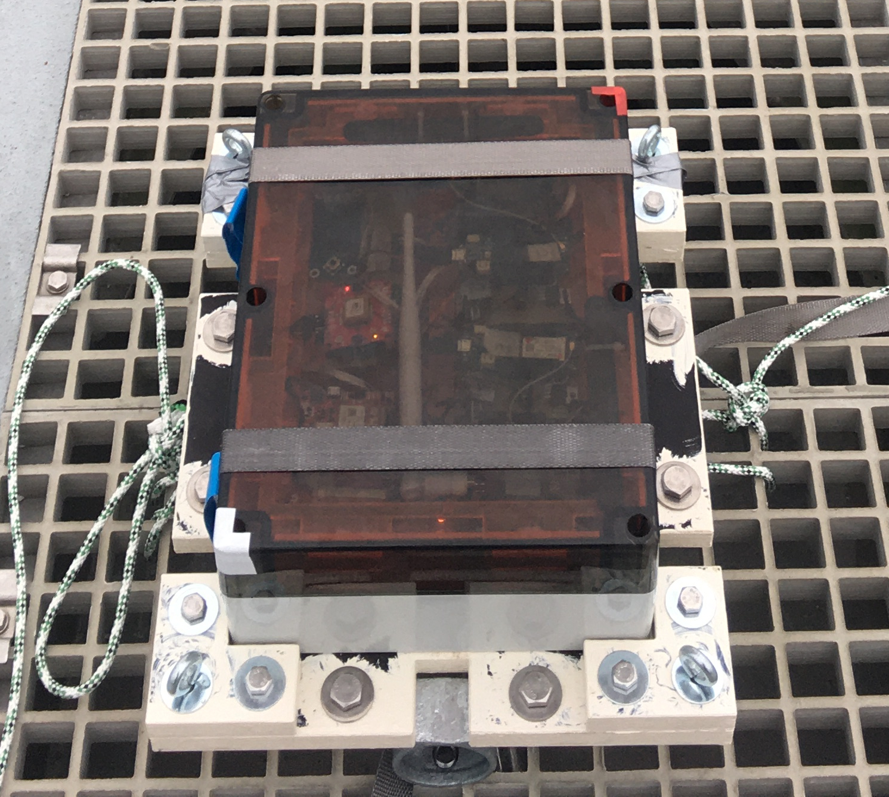
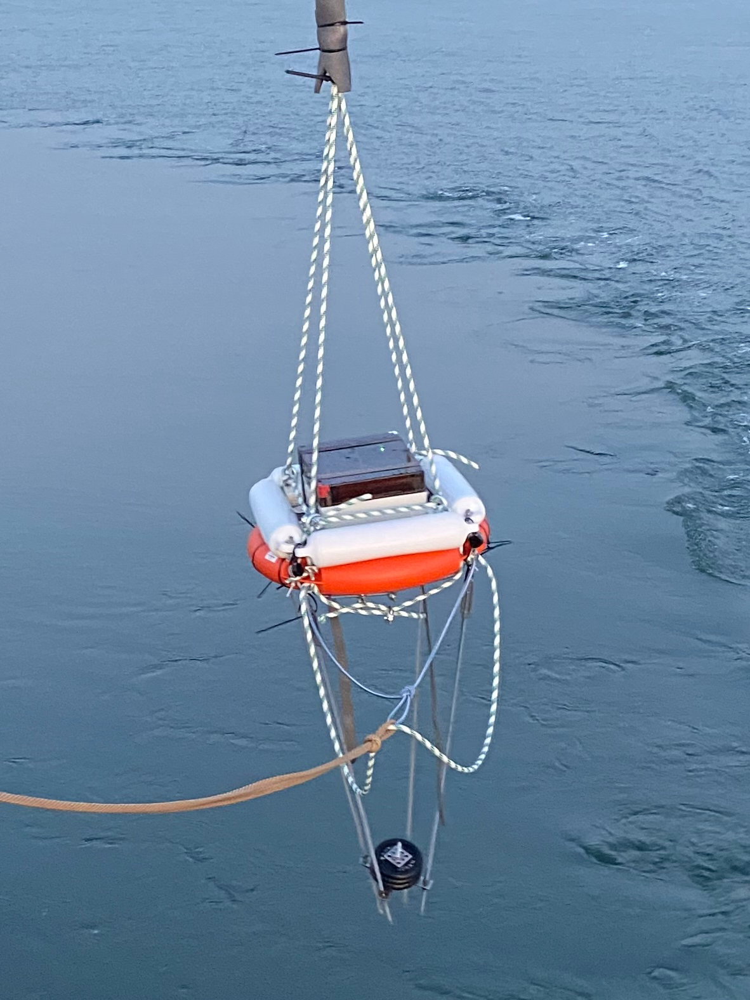
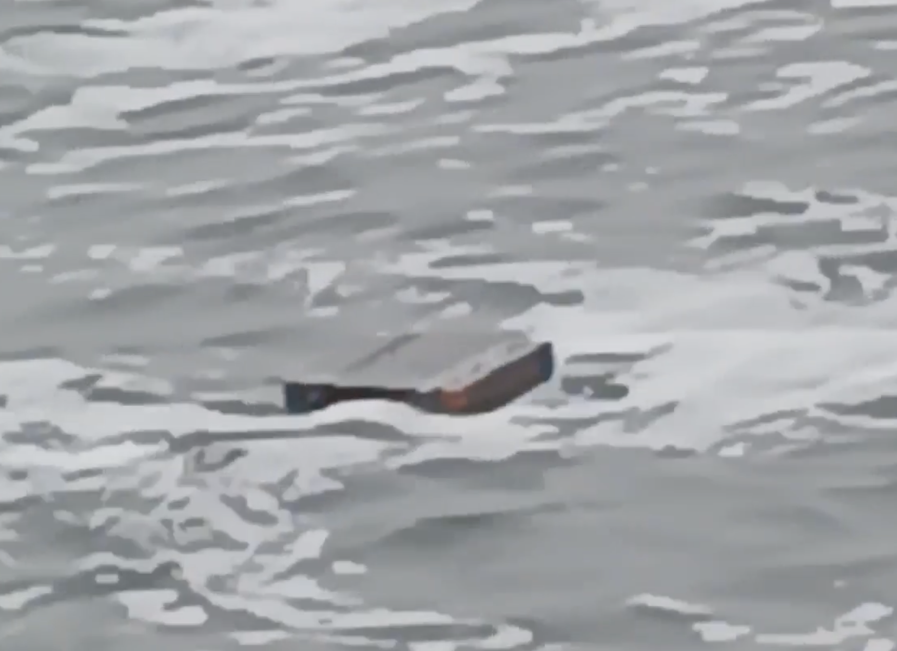

# Instrumentation for Measurements at the Water Surface

This repository documents hardware that was developed to measure signal transmission feasibility from the water surface, see the [repository contents and structures](#repository-contents-and-structure) for an overview. The repository is currently under construction, some more canonic details of the hardware descriptions will be added shortly and marked as [TODO]. Feel free to [contact me](mailto:m.e.schneiter@uu.nl) for content-related questions in the meantime.

The hardware documented here is developed as part of a research project to study marine macroplastic pollution. We examine physical processes and conduct numerical simulations to better understand how and where big pieces of floating plastic are transported. Field measurements from drifter releases complement these approaches by providing track records from known objects that are carried on the water surface. One central component of most drifter types is the reporting of position (or additional) data, which requires signal transmissions from the water surface. The hardware here was developed to further explore the potential of different transmission technologies for this application. We mainly focus on alternatives to commonly used satellite technologies, such as cellular and LoRa. For more background, see the two posters '[poster_august_2024.pdf](./poster_august_2024.pdf)' and '[poster_april_2025.pdf](./poster_april_2025.pdf)'.

We follow open science principles to 
* make our research and insights publicly accessible 
* aid making our research reproducible 
* provide insights into the measurements that generate datasets we provide 
* make material available for projects that build or rely on parts or our project

## Repository Contents and Structure

The repository is structured according to different components of the instrument. These are

* A small [buoy](buoy/README.md) to carry the testbed, built from readily avalilable materials

* A [carrierplate](carrierplate/README.md) to position the testbed in strategic locations. The testbed is straped to the plate which in turn can be fixated to a stirdy rod or rope. This testbed-carrierplate combination is buoyant, such that it can be deployed in water without the buoy.

* A [waterproof testbed](testbed/README.md) consisting of

  * A [conotrol and datalogging sytem](testbed/conotrol_and_datalogging_sytem/README.md) based on a Raspberry Pi. It interfaces with multiple independent devices for which it can switch the power and coomunicate via an I2C bus.

  * An [internal mouting system](testbed/internal_mounting_system/README.md) to structure the space inside the testbed

  * (will be added later) Documentation of the transmission modules used to test signal quality of different technologies

## Team and Funding

The research project is part of the Vici ENW programme ['Tracing Marine Macroplastics by Unraveling the Ocean's Multiscale Transport Processes'](https://www.nwo.nl/en/projects/vic222025)

* Project holder: Marc Schneiter, PhD candidate (m.e.schneiter@uu.nl)
* Contributors:
	* Co-Supervision PhD: Rolf Hut (R.W.Hut@tudelft.nl)
  * Supervision PhD: Erik van Sebille (e.vansebille@uu.nl)
  * Technical support: Marcel Portanger (m.portanger@uu.nl)
  * Deployments and Measurements: Lagrangian Ocean Analysis team Utrecht (https://oceanparcels.org/utrechtteam)
  * Pictures: Isabelle Pelster José (i.pelsterjose@students.uu.nl), Goncalo Borges Simoes de Albergaria Dias (g.borgessimoesdealbergariadias@uu.nl)

## Get involved

Comments and suggestions are always welcome. Please create an issue to share your feedback or question, or if you prefer send a pull request.

## License

This project is released under the [Creative Commons - Attribution - NonCommercial - ShareAlike 4.0](https://creativecommons.org/licenses/by-nc-sa/4.0/) license.