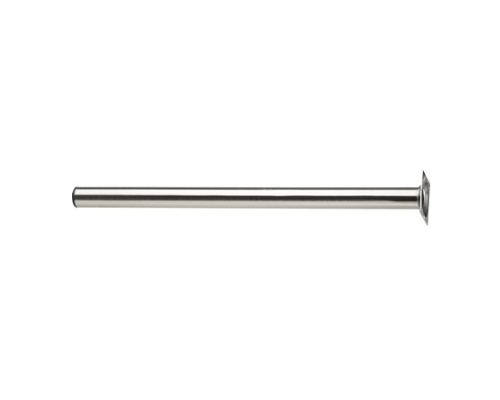
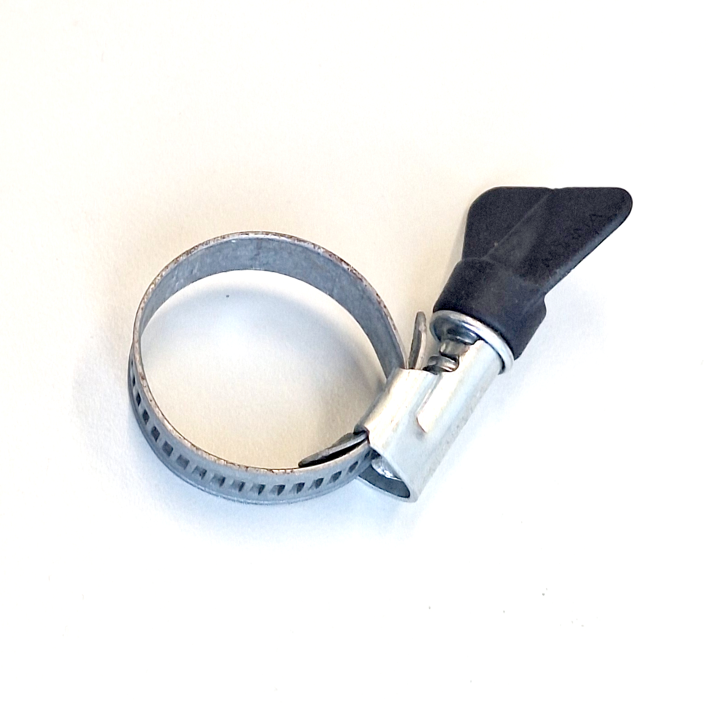
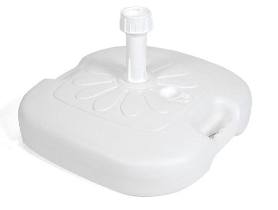

# Base Station

This README documents hardware with a [description](#description), a [list of materials](#list-of-materials), instructions for the [assembly](#assembly), additional [remarks](#remarks), and [example use cases](#example-use-cases).

## Description

This base station is to temporarily place an antenna and connected transmitter on a flat surface.

The main design criteria are
- Weather proofness
- Steady (antenna) in strong winds
- Easy transportation and installation, without the need for modifications at the setup location

 

## List of Materials

The tube and parasol stand can be chosen based on the diameter of the antenna base: The walls of the metal tube should have a width of a few millimeters, to be sturdy but bedabble. The diameter of the metal tube must be slightly larger but not much larger than the diameter of the antenna. The diameter of the tube in turn must fit the fitting of the parasol stand. The stability of the antenna relies on the stability of the parasol stands fitting.

| 
Image
 | Designator | Quantity | Price/Quantity (EUR) | Total Cost (EUR) | Source | Remarks |
| - | - | - | - | - | - | - |
|  | DOLLE Tafelpoot rond Ø 30x600 mm RVS-look | 1 | 9.80 | 9.80 | https://www.hornbach.nl/p/dolle-tafelpoot-rond-o-30x600-mm-rvs-look/7116878/ |  |
|  | Winged Hose Clamp | 1 | ca. 3.00 | ca. 3.00 | - |  |
|  | Parasolvoet 45x45x18cm Vulbaar 16 Liter | 1 | ca. 13.00 | ca. 13.00 | - |  |
| |
|  |  |  |  | **ca. 26.00** |  |  |

## Assembly

Only the metal tube requires a few modifications with basic metalworking, as show here. Four cuts along the length of the tube, together with a winged hose clamp, make up the fitting that can be tightened to fixate the antenna. To thread the cable of the antenna to the transmitter, a hole is drilled below this fitting, keeping the tension and the potential cutting of the metallic edges into the cable from vibrations etc. in mind. The edges of the hole may also be covered, e.g. with a rubber.

Filling the base of the parasol stand with wet sand (or mud) instead of water worked well and avoids drainage in case the base container is leaky, making the installation more reliable.

## Remarks

## Example Use Cases

We used it as a LoRaWan receiver that we installed at the coast for one month.

## License

See the [README](./../README.md) in the [root directory](./../) of this repo for license information