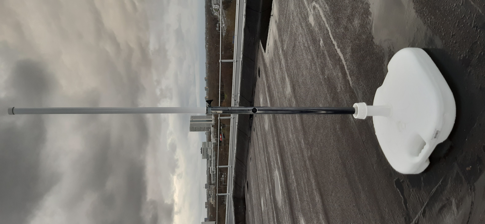
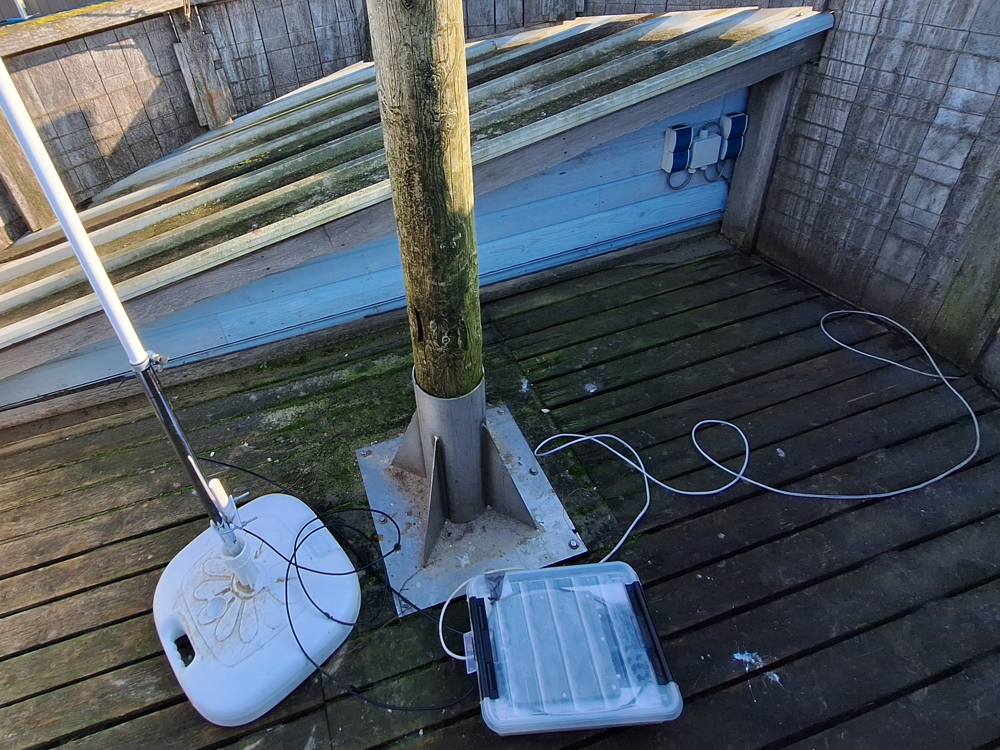

# Base Station

This README documents hardware with a [description](#description), a [list of materials](#list-of-materials), instructions for the [assembly](#assembly), additional [remarks](#remarks), and [example use cases](#example-use-cases).

## Description

[TODO]

 

## List of Materials

| 
Image
 | Designator | Quantity | Price/Quantity (EUR) | Total Cost (EUR) | Source | Remarks |
| - | - | - | - | - | - | - |
| [TODO] |  |  |  |  |  |  |
| |
|  |  |  |  | [TODO] |  |  |

## Assembly

[TODO]

## Remarks

[TODO]

## Example Use Cases

[TODO]

## License

See the [README](./../README.md) in the [root directory](./../) of this repo for license information