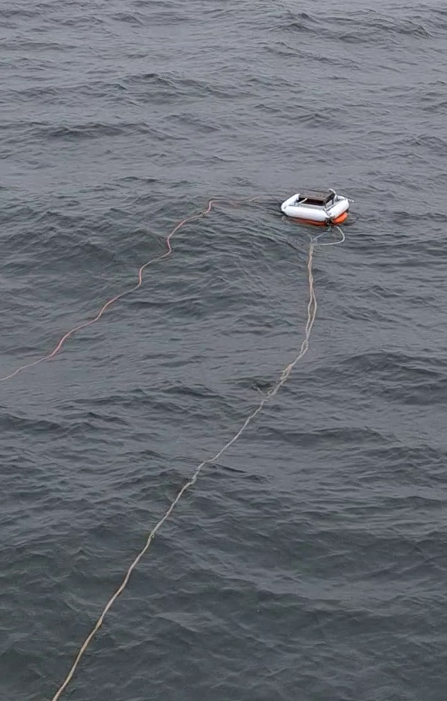

# DIY Buoy

This README documents hardware with a [description](#description), a [list of materials](#list-of-materials), instructions for the [assembly](#assembly), additional [remarks](#remarks), and [example use cases](#example-use-cases).

## Description

This buoy is roughly 1m tall, 0.6m wide, it weighs TODO kg and provides a floating platform of 24x30cm. The design aims at ease of reproducibility by using readily available materials, and at ease of transport and assembly. The dynamics of the buoy in water can be adjusted by adding/removing fenders, by altering the weight of the counterweigh, and by changing the depth and central alignment of the counterweights. Like this, the buoy can for example be tuned to stand more upright when towed at a constant speed.

 

## List of Materials

| 
Image
 | Designator | Quantity | Price/Quantity (EUR) | Total Cost (EUR) | Source | Remarks |
| - | - | - | - | - | - | - |
|  | Safety buoy | 1 | 28.50 | 28.50 | https://www.xxlwater.nl/reddingsboei-leeg-57-cm-met-koord.html | Outer diam. 57cm, Inner diam. 39cm, Ring thickness 9cm, must have holes to attach a rope in 4 corners |
|  | Fender | 4 | 9.29 |  37.16 | https://www.xxlwater.nl/fender-wit.html | Diameter 10cm, Length 42cm, Weight 0.4kg |
|  | Ringfender | 1 | 17.99 | 17.99 | https://www.xxlwater.nl/ringfender-blauw.html | [TODO dimensions, weight] |
|  | Weightlifting weights | 4 | 4.90 | 19.60 | https://www.fitshop.nl/taurus-gietijzer-halterschijven-met-greep-3g-tf-ti0050-3g | Weight 1.25kg, Inner diam. 30mm which is a standard dimension for weight bars |
|  | Rope polyester | [TODO length] | [TODO] | [TODO] | [TODO] | Joins the eyes that lift the buoy with the counterweight, so the used rope must have high tensile and abrasion strengths |
|  | Wire rope clamp | [TODO] | [TODO] | [TODO] | [TODO] |  |
|  | Turnbuckle M8 with eye | [TODO] | [TODO] | [TODO] | [TODO] | The winding direction of either end of turnbuckles is not standardized. They must be matched with the winding direction of the rods |
|  | Threaded rod 1m M8|  |  |  |  | The winding direction of these rods and the turnbuckles must be matched |
|  | Retaining ring M8 |  |  |  |  |  |
|  | Locknut M8 |  |  |  |  |  |
|  | D-Lock | 4 | [TODO] | [TODO] | [TODO] |  |
|  | Zip ties |  |  |  |  |  |
|  | Spacers 30mm for M8 | ~15 to match height of weightlifting weights |  |  |  | Hole diameter matching M8, outer diameter of 30mm to match weightlifting weights |
|  | Bolt 15cm M8 | [TODO] | [TODO] |  | [TODO] |  |
|  | Wing nut M8 | [TODO] | [TODO] |  | [TODO] |  |
| |
|  |  |  |  | [TODO] |  |  |

## Assembly

Fabrication of the mounting cross for the weights

   * According to the blueptint '[blueprint_counterweight_mount_v2.pdf](blueprint_counterweight_mount_v2.pdf)'

   * The dimensions of the cross must be adjusted to the outer diameter of the weightlifting weights. The hole diameters are chosen larger than the diameter of the four threaded rods to allow enough clearance to create the V-shape of the counterweight.

   * TODO material choice

The following steps describe an assembly that aims at making transportation easy and handeling during the deployment easy and fast. For example, the float and counterweight can be transported separaterly, and the weights are only added at the end. It may be useful to change the order of the steps for other scenarios.

1) Float (without fenders)

   * With the carrier plate stacked on the safety buoy, thread the polyester rope trough one of the eyes of the carrier plate, the aligned holes of the safety buoy, and an eye of the turnbuckles that connect to the counterweight. This is repeated for all four corners, the loops are closed with one or two wire rope clamp(s). These loops mechanically connect the eyes of the carrier plate to the eyes holding the counterweight. They thus are the crutial part to consider when the buoy is lifted at the eyes of the carrier plate.

2) Counterweight (without weights)

   * Connect one turnbuckle to each rod. To avoid loosening between rods and turnbuckles from vibrations, these connections may be permanently fixated.

   * Connect one lock nut to the open end of each rod, mkaing sure that the nut interlocks with the rod. This is to avoid loosing the cross and mounted weights.

   * Connect the the four threaded rods to the cross carrying the counter weights with retaining rings. Each rod has one retaining ring above and one retaining ring below the cross, leaving enough clearance in between to create the V-shape of the counterweight. It is necessary for step 4 that the rods can be rotated along their axes. The mounting height on each rod can be adjusted to tune the buoy dynamics.

3) Joining float and counterweight

   * This can be done on site, for example after the transport.

   * Each turnbuckle is connected to an eye of the float.

   * Each pair of turnbuckle and eye are bound together for example with a ziptie, to avoid any loosening from vibrations.

4) Mounting an object to the carrier plate

   * With both the top and bottom of the carrier plate being accessible, the carried object can be tied to the plate.

5) Adding fenders to the float

   * Side fenders: The four fenders are joined with D-Locks and at each edge tied to an eye of the carrier plate, for example with zip ties.

   * Bottom ring fender: The ring fender is placed inside and tied to the safety buoy, for example with zip ties.

6) Adding the weights

   * A variable number of weights is fixed to the cross by inserting a long threaded bolt trough the center hole of the cross, loading it with washers with a diameter equal to the inner diameter of the weightlifting weights, adding the weights, adding a stirdy top to horizontally fixate the weigths, and fasterning the top for example with a wing nut.

## Remarks

* Vibrations caused by the ship during transits, and the perpetual motion in the water lossened the connections at the turnbuckles. This effect was supressed by using zip ties as described in step 3 above. This imporived but did not completely solve the issue. The same applies to the screw-locks of the retaining rings, which worked reliably during 12h when strongly tightened

<!--
[//]: # (* Lifting and towing: The )

[//]: # 
-->

## Example Use Cases

This buoy has been used twice, each time continuously for 12h on a ship. For roughly half of the time it was carried mid air on the end of a crane extending from the deck, and for the other half it was floating in water with waves up to 50cm.

## License

See the [README](./../README.md) in the [root directory](./../) of this repo for license information