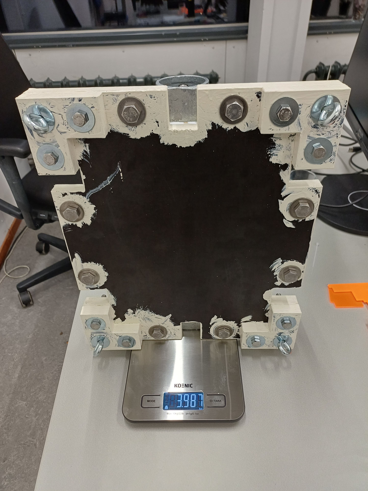
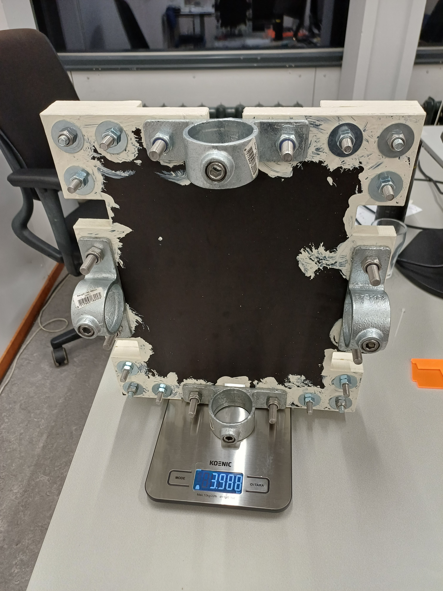

# Carrierplate

This README documents hardware with a [description](#description), a [list of materials](#list-of-materials), instructions for the [assembly](#assembly), additional [remarks](#remarks), and [example use cases](#example-use-cases).

## Description

This carrierplate has dimensions of 380x320(x10)cm, it weighs [TODO]kg and provides a platform of 24x30cm. The testbed-carrierplate combination is buoyant, such that it can be deployed in water without the buoy. Other objects can be tied to it with ratchet straps at the six slits along the edges. The plate can be equipped with eyes and rod clamps for mounting options. The design aims at ease of reproducibility by using readily available materials, and at ease of assembly.

 

## List of Materials

| 
Image
 | Designator | Quantity | Price/Quantity (EUR) | Total Cost (EUR) | Source | Remarks |
| - | - | - | - | - | - | - |
|  | Betonplex | 0.2m2 | 22.43 per m2 | 4.49 | https://www.hornbach.nl/p/betonplex-eucalyptus-2500x1250x18-mm/10692335/ | Thickness 18mm |
|  | Edge sealer paint | 0.1l | 31.93 per liter  | 3.19 | https://www.hornbach.nl/p/build-kopse-randsealer-wit-750-ml/6533706/ |  |
|  | Rod clamp | 4 | 7.95 | 31.80 | https://www.hornbach.nl/p/beugel-vlak-steigerbuis-o-48-mm/5706771/ | Dimensions to consider for the placement on the plate are: Holes M10, distance between the two mounting holes, width of the clamp to avoid completely closing a slit for the straps |
|  | Ring eye |  |  |  | [TODO] |  |
|  | Bolt |  |  |  | [TODO] |  |
|  | Locknut |  |  |  | [TODO] |  |
|  | Washer |  |  |  | [TODO] |  |
|  | Ratchet straps | 2 | 5.50 | 11.00 | https://www.hornbach.nl/p/sjorband-mamutec-25-mm-5-m/7769185/ |  |
| |
|  |  |  |  | [TODO] |  |  |

## Assembly

1) Fabrication of the betonplex pieces according to the blueprint in ['blueprint_carrierplate_v2.pdf'](blueprint_carrierplate_v2.pdf)

2) Coating the open edges with edge sealer paint

3) Assembly with metal clamps and eyes

## Remarks

[TODO]

## Example Use Cases

[TODO]

## License

See the [README](./../README.md) in the [root directory](./../) of this repo for license information