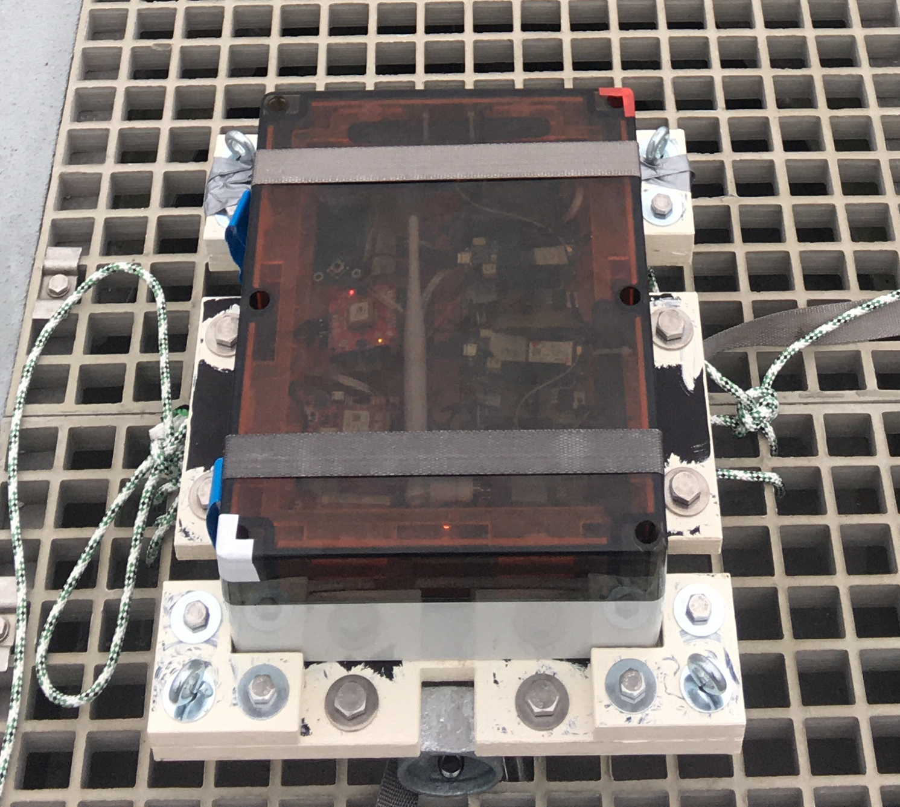
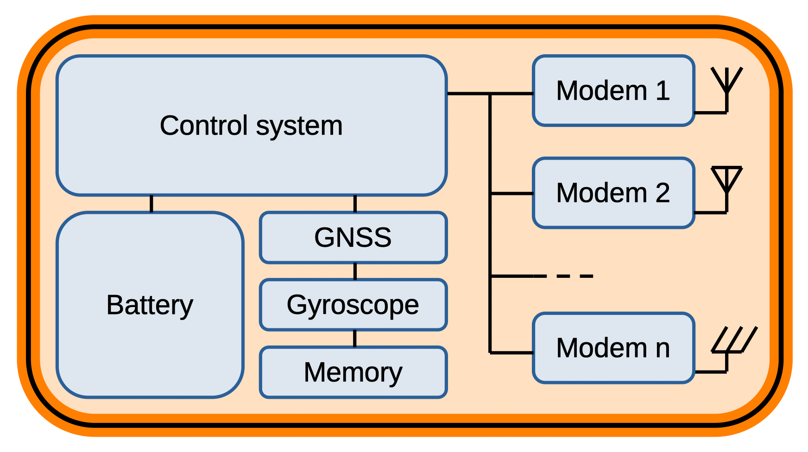
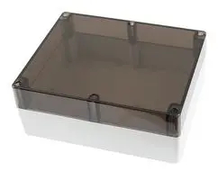
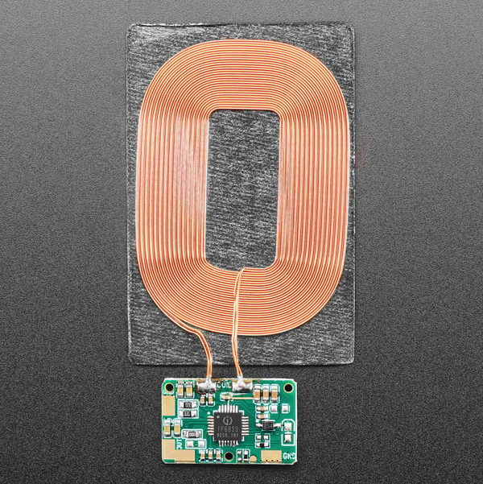
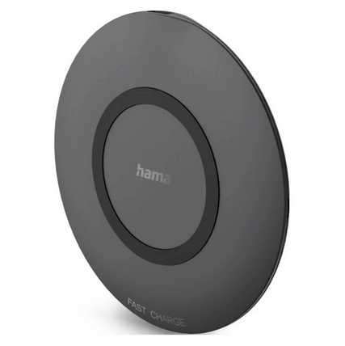
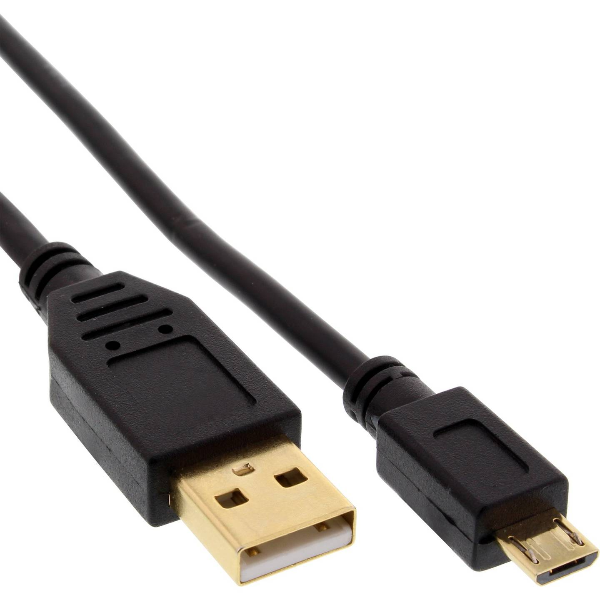

# Waterproof Testbed

The documentation of the subcomponents can be found in the subdirectories.

## Waterproof Case

The case that houses the electronics was chosen for its waterproofness rating IP68, and was found to be at least reasonably permissive to radio signals in the range of a few 100MHz to a few GHz. It conveniently features a transparent cover. More info and documentation can be found in the files ['info_waterproof_case.pdf'](info_waterproof_case.pdf) and 
['blueprint_waterproof_case.pdf'](blueprint_waterproof_case.pdf) .

| 
Image
 | Designator | Quantity | Price/Quantity (EUR) | Total Cost (EUR) | Source | Remarks |
| - | - | - | - | - | - | - |
|  | Polycarbonate Case 1554YA2GYSL | 1 | 79.99 | 79.99 | https://www.conrad.nl/nl/p/hammond-electronics-1554-pc-sl-1554ya2gysl-universele-behuizing-polycarbonaat-grijs-1-stuk-s-2201467.html | IP68, transparent cover, reasonably permissive for 100MHz-10GHz |

## Wireless Charging

We achieve a charging current of 1 ampere for a standard 5 volts power bank trough the 4mm thick wall of the case. The solution consists of a standard 15 watts wireless charger and a wireless receiver module that supports the inductive charging Qi standard, which is commonly supported by modern wireless charger pads for mobile phones.

Wireless charging can be used to continuously run the test system, which facilitates the sometimes time consuming and delicate process of equipping and closing (sealing) the testbed for reliable waterproofness, and it avoids the need to open the box for charging. While wireless charging is slower than charging with a wire, it is possible to attain a practical charging rate.

Integration considerations

* An USB charging cable can be directly soldered to the terminals of the wireless receiver module and connected to the power bank. The quality of the power cable is crucial for the charging efficiency, which can vary greatly between different cables (more than 50% of charging current).

* To optimally align the charger pad with the receiver module, markings can be added at the outside of the case by monitoring the charging rate of the receiver module for different positions of the charging pad. For the project here, the charging rate did not vary noticeably from small displacements (1cm).

* To monitor and assure continuous charging, it is helpful to monitor the current consumption of the charging pad, for example with a USB power meter. Some charging pads also have status LEDs to indicate the presence of chargeable devices.

| 
Image
 | Designator | Quantity | Price/Quantity (EUR) | Total Cost (EUR) | Source | Remarks |
| - | - | - | - | - | - | - |
|  | Universal Qi Wireless Receiver Module | 1 | 12.86 | 12.86 | https://mou.sr/4018GuF | 5 volts inductive charging with Qi standard |
|  | Hama Wireless charger 15 W 201746 00201746 | 1 | 19.83 | 19.83 | https://www.conrad.nl/nl/p/hama-inductie-lader-15-w-201746-00201746-uitgangen-qi-standaard-zwart-3533576.html | Charging with Qi standard and high charge rating (here 15W with Qi 2 technology) |
|  | USB charging cable | 1 |  |  | https://www.conrad.nl/nl/p/hama-inductie-lader-15-w-201746-00201746-uitgangen-qi-standaard-zwart-3533576.html | Should be tested for efficient charging. Alternative: USB connector and wire |

## License

See the [README](./../README.md) in the [root directory](./../) of this repo for license information