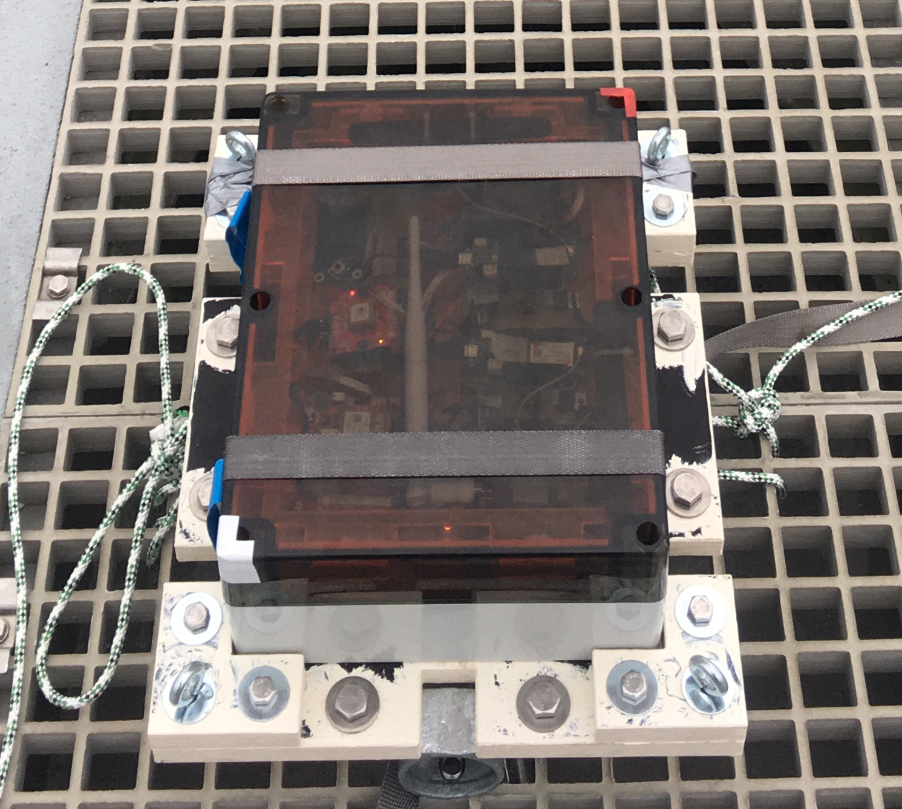

# Waterproof Testbed

The documentaion of the subcomponents can be found in the subdirectories.

## Waterproof Case

The case that houses the electronics was chosen for its waterproofness rating IP68, and was found to be at least reasonably permissive to radiosignals in the range of a few 100MHz to a few GHz. It conveniently features a transparent cover. More info and documentation can be found in the files ['info_waterproof_case.pdf'](info_waterproof_case.pdf) and 
['blueprint_waterproof_case.pdf'](blueprint_waterproof_case.pdf) .

| 
Image
 | Designator | Quantity | Price/Quantity (EUR) | Total Cost (EUR) | Source | Remarks |
| - | - | - | - | - | - | - |
|  | Polycarbonate Case 1554YA2GYSL | 1 | 79.99 | 79.99 | https://www.conrad.nl/nl/p/hammond-electronics-1554-pc-sl-1554ya2gysl-universele-behuizing-polycarbonaat-grijs-1-stuk-s-2201467.html | IP68, transparent cover, reasonably permissive for 100MHz-10GHz |

## License

See the [README](./../README.md) in the [root directory](./../) of this repo for license information