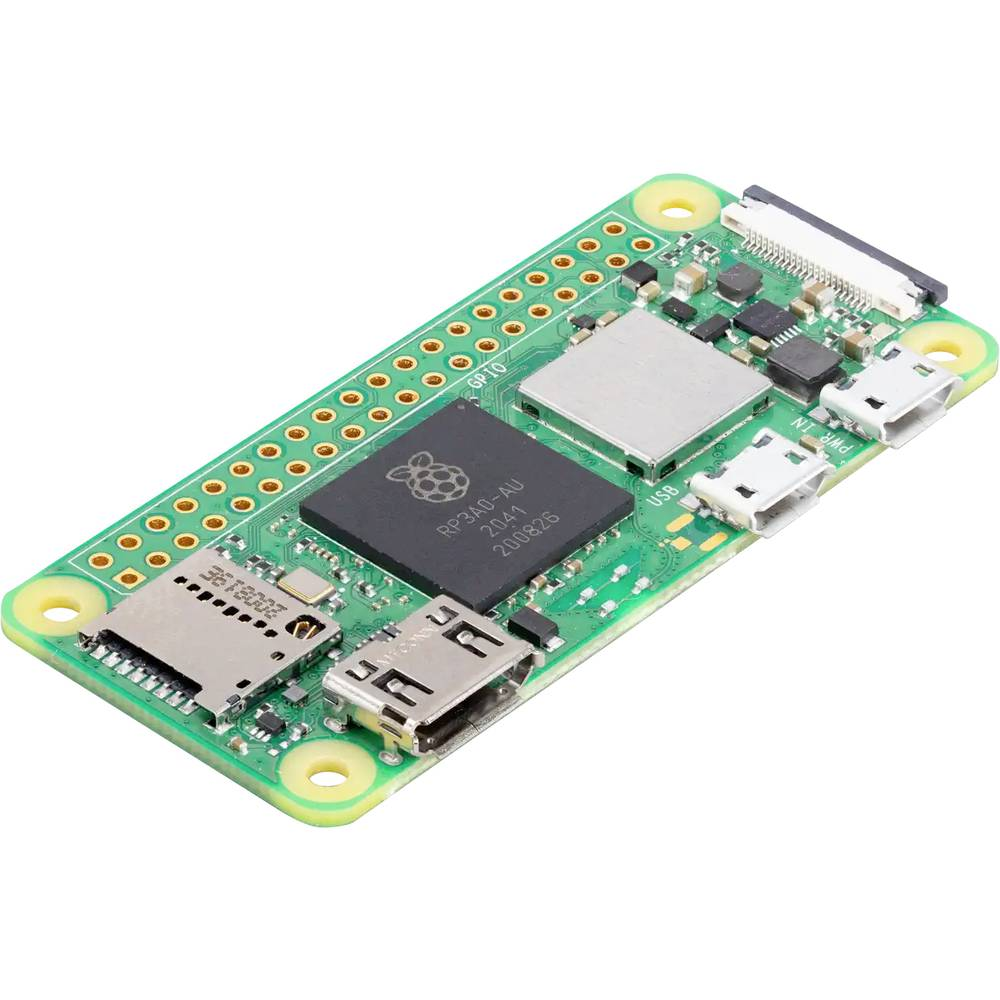
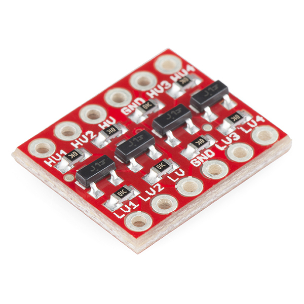
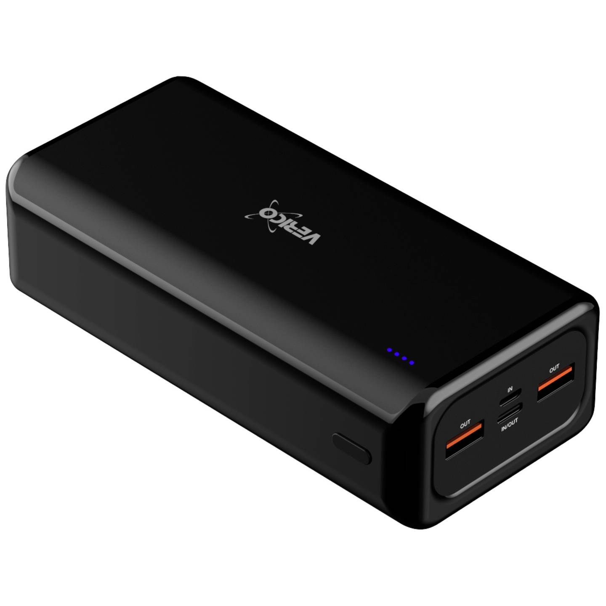
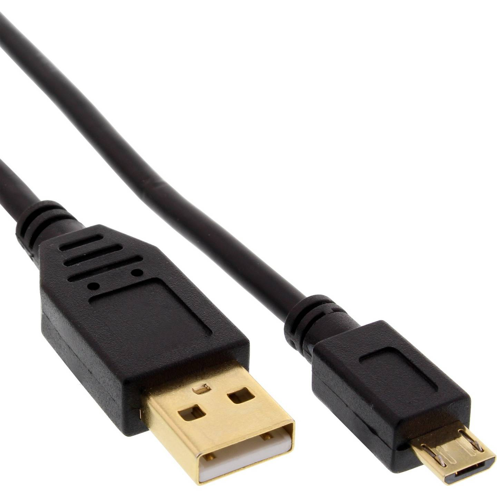
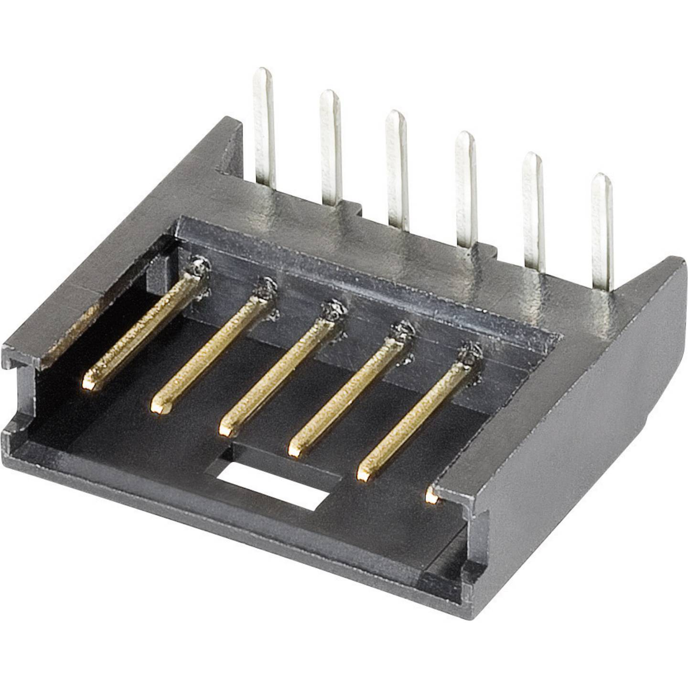
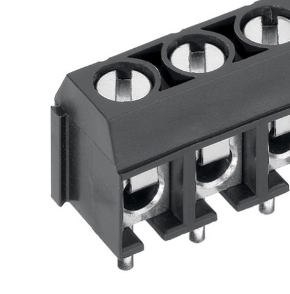
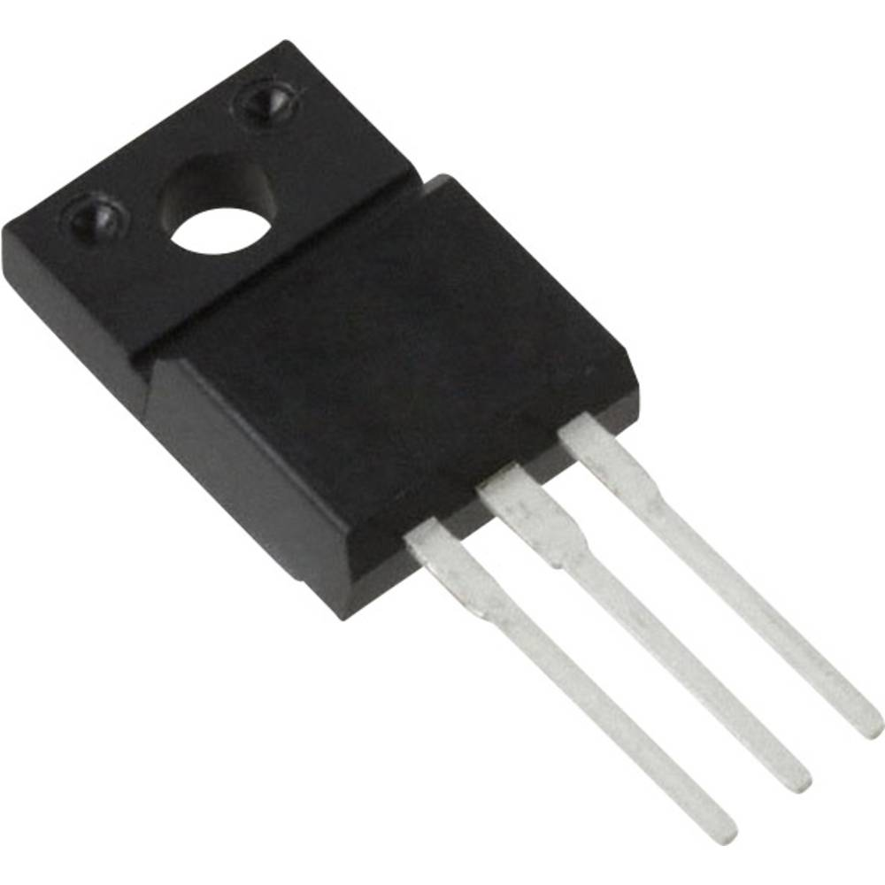
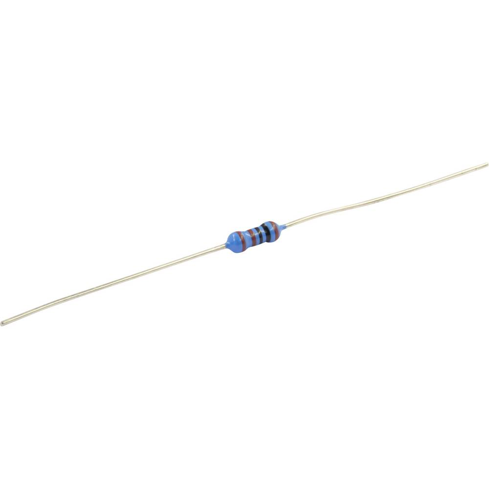
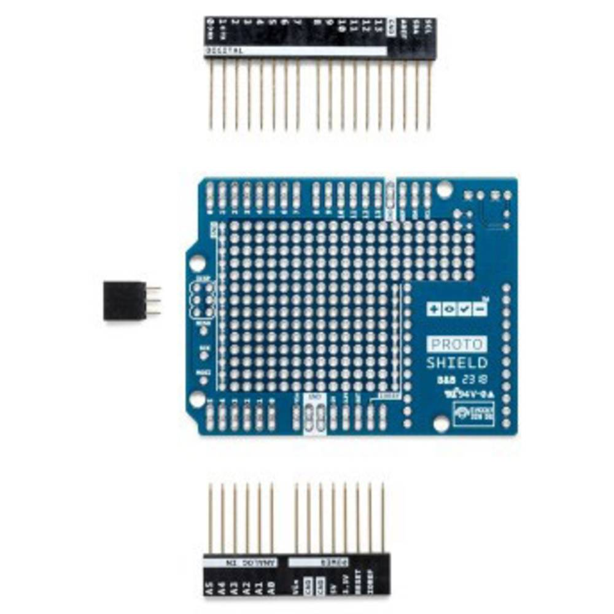

# Conotrol and Datalogging Sytem

This README documents hardware with a [description](#description), a [list of materials](#list-of-materials), instructions for the [assembly](#assembly), additional [remarks](#remarks), and [example use cases](#example-use-cases). The software for the main board and an example for interface boards connecting to an Arduino is provided in the [software](./software/) directory.

## Description

The hardware and software described here enables two main functionalities:

1) Remote, programmable power control by the main board (Raspberry Pi) for each module

2) A shared I2C bus with the main board (Raspberry Pi) as the root device and the modules as the node devices

In addition, the scripts in the [software](./software/) directory include

* Routines to read and write data of different types from and to the modules

* Testing and debugging of the I2C communication with a VERBOSE flag

* An example implementation of the module interface for Arduino UNO, with time synchronization, a read-write register, and a remotely invokable funtion

The interface board only occupies the I2C pins of the module. This makes the interface board stackable with any board that does not rely on the two I2C pins. For Arduinos and in case of a double-occupation of the hardware I2C interface, either I2C bus can be configured to use alternative pins with the [SoftwareSerial.h](https://docs.arduino.cc/learn/built-in-libraries/software-serial/) library.

## List of Materials

### Main Board

| 
Image
 | Designator | Quantity | Price/Quantity (EUR) | Total Cost (EUR) | Source | Remarks |
| - | - | - | - | - | - | - |
|  | Raspberry Pi - Raspberry Pi® Zero 2 W 512 MB 1 x | 1 | 18.48 | 18.48 | https://www.conrad.com/en/p/raspberry-pi-zero-2-w-raspberry-pi-zero-2-w-512-mb-1-x-1-0-ghz-2482940.html |  |
|  | Logic Level Converter - SparkFun Logic Level Converter Bi Directional | 2-3 | 3.50 | 2-3 * 3.50 | https://opencircuit.shop/product/sparkfun-logic-level-converter-bi-directional | Number of required channels is 2+number of modules |
|  | Power Bank - Verico Power Pro PD Power bank 30000 mAh LiPo USB type | 1 | 30.24 | 30.24 | https://www.conrad.com/en/p/verico-power-pro-pd-power-bank-30000-mah-lipo-usb-type-a-usb-c-black-2583063.html |  |
|  | Micro USB cable |  |  |  |  | Should be tested to reliably provide sufficient power to the Pi |
|  | [TODO Pi-header] |  |  |  |  |  |
|  | [TODO USB connector exposing pins] |  |  |  |  |  |
|  | (6pin board connector - TE Pin strip AMPMODU MOD II Contact spacing: 2.54 mm) | (no. modules) | (1.08) | (N * 1.08) | https://www.conrad.com/en/p/te-connectivity-pin-strip-standard-ampmodu-mod-ii-total-number-of-pins-6-contact-spacing-2-54-mm-280379-2-1-pc-s-1079641.html | Contact spacing 2.54mm, 5pin connector also suffices |
|  | (2pin power screw terminal - PTR Hartmann 50500020134G Contact spacing: 5.08 mm) | (1) | (0.17) | (0.17) | https://www.conrad.nl/nl/p/ptr-hartmann-50500020134g-klemschroefblok-1-50-mm-aantal-polen-2-grijs-1-stuk-s-731877.html |  |
|  | PCB Prototype Board | 1 |  |  |  | Contact spacing 2.54mm, TODO approx dimensions |
| |
|  |  |  |  | [TODO] |  |  |

### Module Interface

| 
Image
 | Designator | Quantity | Price/Quantity (EUR) | Total Cost (EUR) | Source| Remarks |
| - | - | - | - | - | - | - |
|  | Logic Level Converter - SparkFun Logic Level Converter Bi Directional | 1 | 3.50 | 3.50 | https://opencircuit.shop/product/sparkfun-logic-level-converter-bi-directional |  |
|  | P channel enhanced MOSFET - Vishay IRF9540PBF MOSFET | 1 | 1.23 | 1.23 | https://www.conrad.nl/nl/p/vishay-irf9540pbf-mosfet-1-p-kanaal-150-w-to-220ab-597146.html |  |
|  | N channel enhanced MOSFET - Vishay IRFZ44PBF MOSFET | 1 | 1.64 | 1.64 | https://www.conrad.nl/nl/p/vishay-irfz44pbf-mosfet-1-n-kanaal-150-w-to-220ab-597269.html |  |
|  | Resistor 1K | 1 |  |  |  |  |
|  | Resistor 10K | 2 |  |  |  |  |
|  | (6pin board connector - TE Pin strip AMPMODU MOD II Contact spacing: 2.54 mm) | (1) | (1.08) | (1.08) | https://www.conrad.com/en/p/te-connectivity-pin-strip-standard-ampmodu-mod-ii-total-number-of-pins-6-contact-spacing-2-54-mm-280379-2-1-pc-s-1079641.html | Contact spacing 2.54mm, 5pin connector also suffices |
|  | (2pin power screw terminal - PTR Hartmann 50500020134G Contact spacing: 5.08 mm) | (1) | (0.17) | (0.17) | https://www.conrad.nl/nl/p/ptr-hartmann-50500020134g-klemschroefblok-1-50-mm-aantal-polen-2-grijs-1-stuk-s-731877.html |  |
|  | PCB Prototype Board Contact spacing: 2.54 mm - (Arduino PROTO SHIELD Development board) | 1 | (12.39) | (12.39) | https://www.conrad.nl/nl/p/arduino-proto-shield-development-board-1969858.html | Contact spacing 2.54mm |
| |
|  |  |  |  | [TODO] |  |  |

## Assembly

[TODO]

## Remarks

[TODO]

## Example Use Cases

This system has been used for measurements in two setups. The first setup consisted of Arduino UNOs and Arduino MKRs

## License

See the [README](./../../README.md) in the [root directory](./../../) of this repo for license information