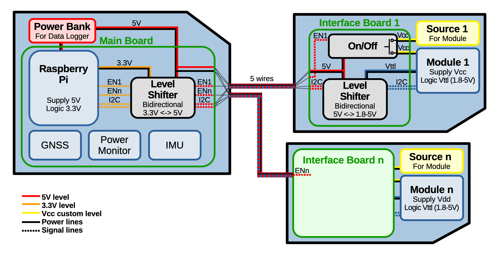

# Conotrol and Datalogging Sytem

This README documents hardware with a [description](#description), a [list of materials](#list-of-materials), instructions for the [assembly](#assembly), additional [remarks](#remarks), and [example use cases](#example-use-cases). The software for the main board and an example for interface boards connecting to an Arduino is provided in the [software](./software/) directory.

## Description

Here a description, possibly with images for illustration. What is the component, what is it for, (how was it used)

## List of Materials

### Main Board

| 
Image
 | Designator | Quantity | Price/Quantity (EUR) | Total Cost (EUR) | Source | Remarks |
| - | - | - | - | - | - | - |
|  | Raspberry Pi - Raspberry Pi® Zero 2 W 512 MB 1 x | 1 | 18.48 | 18.48 | https://www.conrad.com/en/p/raspberry-pi-zero-2-w-raspberry-pi-zero-2-w-512-mb-1-x-1-0-ghz-2482940.html |  |
|  | Logic Level Converter - SparkFun Logic Level Converter Bi Directional | 2-3 | 3.50 | 2-3 * 3.50 | https://opencircuit.shop/product/sparkfun-logic-level-converter-bi-directional | Number of required channels is 2+number of modules |
|  | Power Bank - Verico Power Pro PD Power bank 30000 mAh LiPo USB type | 1 | 30.24 | 30.24 | https://www.conrad.com/en/p/verico-power-pro-pd-power-bank-30000-mah-lipo-usb-type-a-usb-c-black-2583063.html#attributesNotes_facts |  |
|  | Micro USB cable |  |  |  |  | Should be tested to reliably provide sufficient power to the Pi |
|  | TODO Pi-board connector |  |  |  |  |  |
|  | TODO USB connector exposing pins |  |  |  |  |  |
|  | (6pin board connector - TE Pin strip AMPMODU MOD II Contact spacing: 2.54 mm) | (no. modules) | (1.08) | (N * 1.08) | https://www.conrad.com/en/p/te-connectivity-pin-strip-standard-ampmodu-mod-ii-total-number-of-pins-6-contact-spacing-2-54-mm-280379-2-1-pc-s-1079641.html | Contact spacing 2.54mm, 5pin connector also suffices |
|  | (2pin power screw terminal - PTR Hartmann 50500020134G Contact spacing: 5.08 mm) | (1) | (0.17) | (0.17) | https://www.conrad.nl/nl/p/ptr-hartmann-50500020134g-klemschroefblok-1-50-mm-aantal-polen-2-grijs-1-stuk-s-731877.html |  |
|  | PCB Prototype Board | 1 |  |  |  | Contact spacing 2.54mm, TODO approx dimensions |
| |
|  |  |  |  | TODO |  |  |

### Module Interface

| 
Image
 | Designator | Quantity | Price/Quantity (EUR) | Total Cost (EUR) | Source| Remarks |
| - | - | - | - | - | - | - |
|  | Logic Level Converter - SparkFun Logic Level Converter Bi Directional | 1 | 3.50 | 3.50 | https://opencircuit.shop/product/sparkfun-logic-level-converter-bi-directional |  |
|  | P channel enhanced MOSFET - Vishay IRF9540PBF MOSFET | 1 | 1.23 | 1.23 | https://www.conrad.nl/nl/p/vishay-irf9540pbf-mosfet-1-p-kanaal-150-w-to-220ab-597146.html |  |
|  | N channel enhanced MOSFET - Vishay IRFZ44PBF MOSFET | 1 | 1.64 | 1.64 | https://www.conrad.nl/nl/p/vishay-irfz44pbf-mosfet-1-n-kanaal-150-w-to-220ab-597269.html |  |
|  | Resistor 1K | 1 |  |  |  |  |
|  | Resistor 10K | 2 |  |  |  |  |
|  | (6pin board connector - TE Pin strip AMPMODU MOD II Contact spacing: 2.54 mm) | (1) | (1.08) | (1.08) | https://www.conrad.com/en/p/te-connectivity-pin-strip-standard-ampmodu-mod-ii-total-number-of-pins-6-contact-spacing-2-54-mm-280379-2-1-pc-s-1079641.html | Contact spacing 2.54mm, 5pin connector also suffices |
|  | (2pin power screw terminal - PTR Hartmann 50500020134G Contact spacing: 5.08 mm) | (1) | (0.17) | (0.17) | https://www.conrad.nl/nl/p/ptr-hartmann-50500020134g-klemschroefblok-1-50-mm-aantal-polen-2-grijs-1-stuk-s-731877.html |  |
|  | PCB Prototype Board Contact spacing: 2.54 mm - (Arduino PROTO SHIELD Development board) | 1 | (12.39) | (12.39) | https://www.conrad.nl/nl/p/arduino-proto-shield-development-board-1969858.html | Contact spacing 2.54mm |
| |
|  |  |  |  | TODO |  |  |

## Assembly

## Remarks

* Testing: expect the unexpected

## Example Use Cases