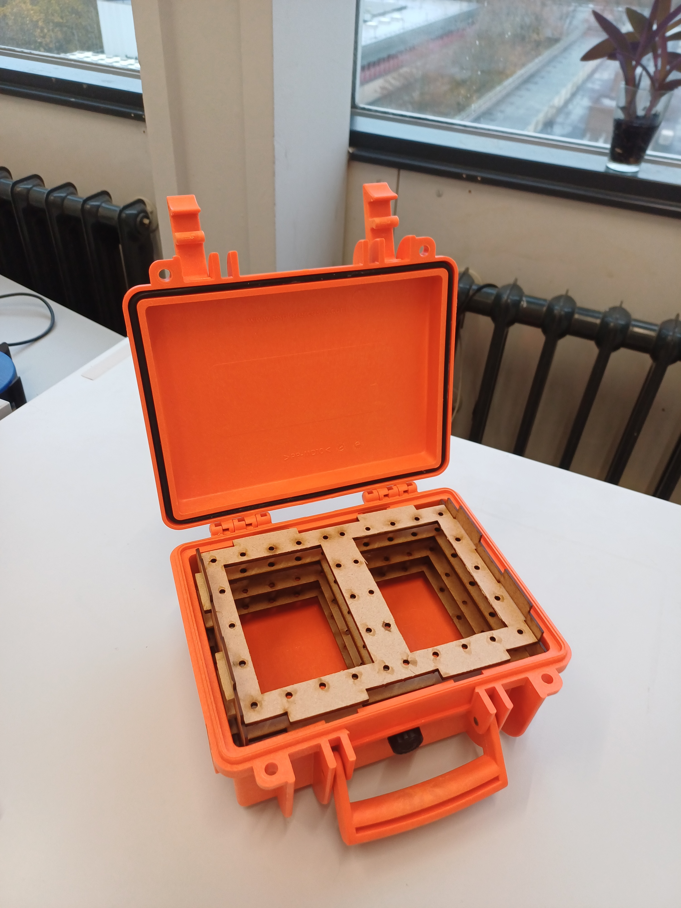
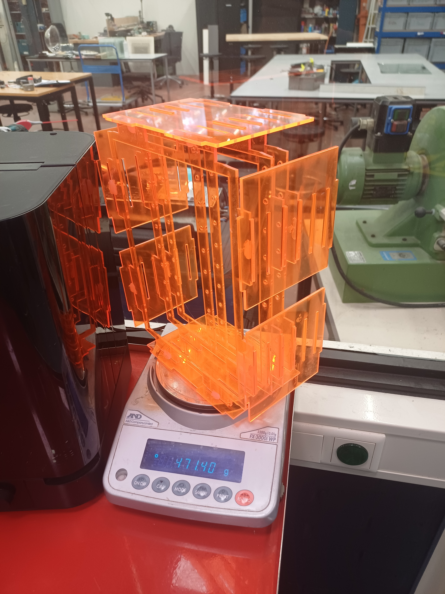

# Internal Mounting System

This mounting system is a customizable concept to create a rigid arrangement of the space inside a rectangular box.

The detailed description with blueprints and example cutouts can be found in the file '[documentation_internal_mounting _system.pdf](documentation_internal_mounting _system.pdf)'. Example files of laster cuts are also provided in the directory '[lasercuts](./lasercuts/)'. The tools used are the laser cutter and a sander. The materials used are cardboard, wood, and acrylic plastic.

This project was realized in the Maker space [Lili's Proto Lab](https://www.uu.nl/en/research/lilis-proto-lab) at Utrecht University, it is documented in this [social media post](https://www.instagram.com/lilisprotolab/p/DIN57aNspcx/?next=%2F&img_index=1).

## License

See the [README](./../../README.md) in the [root directory](./../../) of this repo for license information